# Quick Start Guide

Welcome! This guide walks you through setting up the app, preparing set/card data, and detecting a decklist from an image.

---

## 1. First-Time Setup

1. **Download** the latest release zip from the [Releases page](https://github.com/SamTheCoder777/WeissSchwarzDeckImporter/releases) and unzip it to a folder of your choice.

2. Locate **`vc_redist.x64.exe`** on the unzipped folder and run it to download the required [Visual C++ runtime libraries](https://learn.microsoft.com/en-us/cpp/windows/latest-supported-vc-redist?view=msvc-170)

3. **Download the two required models** (`.onnx` files) from the links below, and place both files directly inside the unzipped folder:
   - [Model 1 — Card Identifier](https://huggingface.co/SamTheCoder777/Card_Identifier/resolve/main/card_identifier.onnx?download=true)
   - [Model 2 — Card Detector](https://huggingface.co/SamTheCoder777/Card_Detector/resolve/main/card_detector.onnx?download=true)

4. Locate **`WSDeckImporter.exe`** inside the unzipped folder and launch it.

   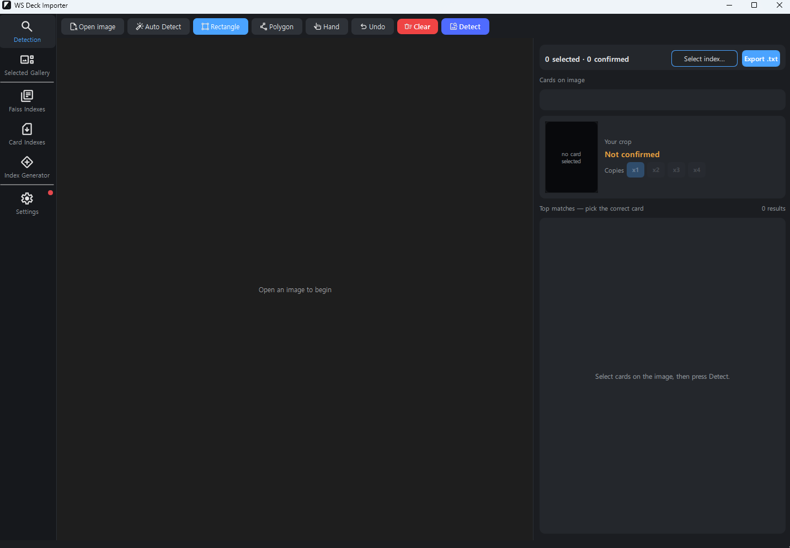

5. Open **Settings**, then use the **Browse** buttons to link each model file to its corresponding field.

   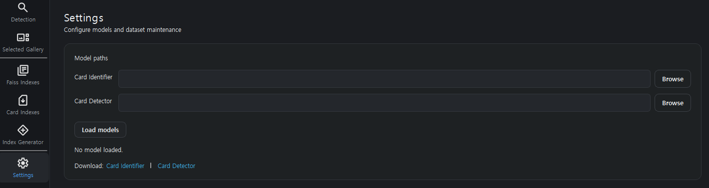

6. Click **Load Models**.

Once the models are loaded, setup is complete and you won't need to repeat these steps again.

---

## 2. Downloading Set & Card Data

Before importing a decklist, you need to download data for the specific set you're working with.

### Faiss Index Data

1. Navigate to the **Faiss Index** page.

   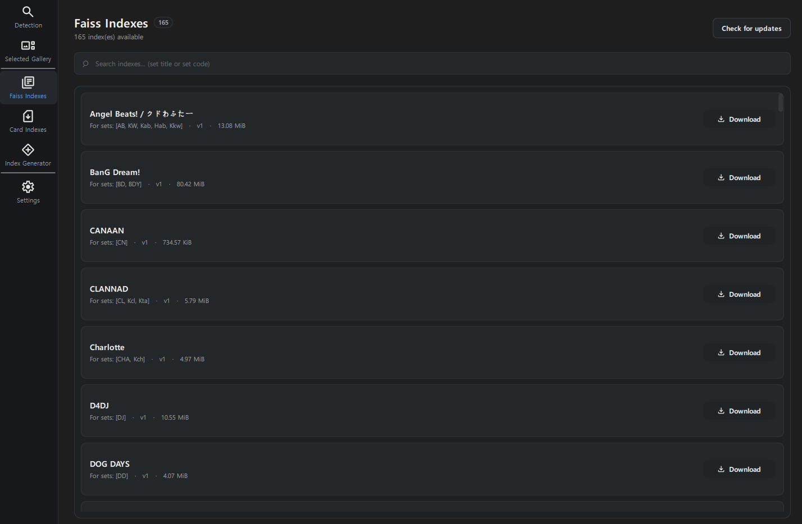

2. Search for your set — **searching by set code works best**.

   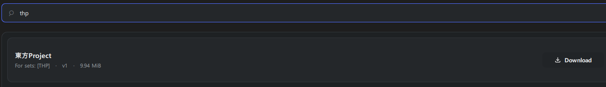

3. Download the result and click **Use**.

   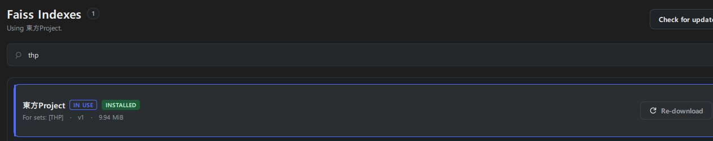

### Card Index Data

4. Navigate to the **Cards Index** page.

   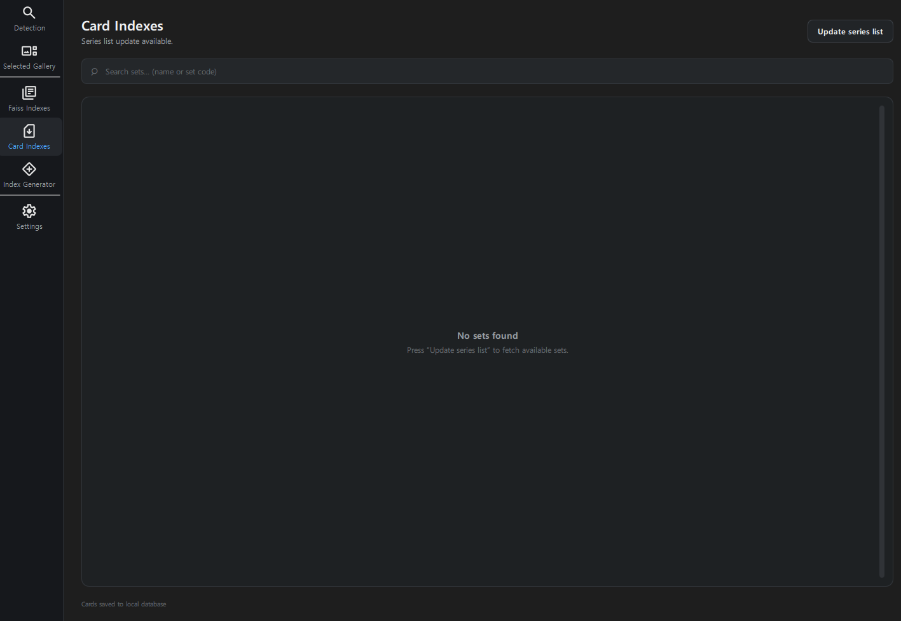

5. Click **Update series list** button.
   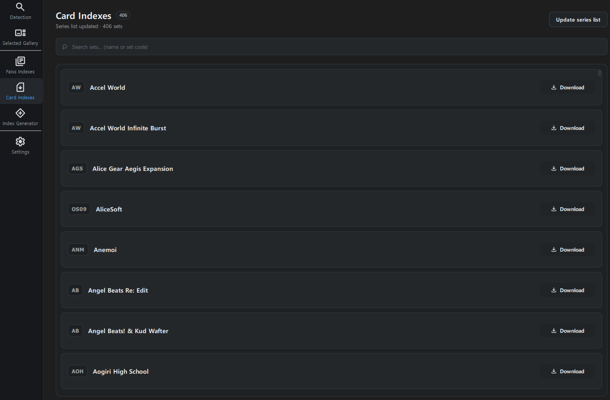

6. Just like the Faiss Index page, **searching by set code works best**.

   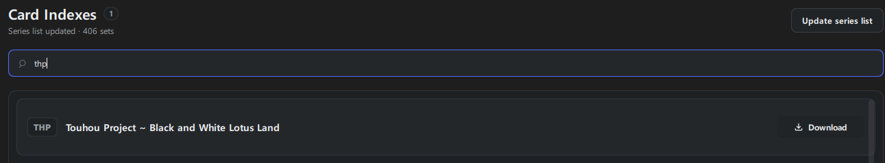

>  [!NOTE]
>  There could be multiple indexes of the same card set (same code). You should download all of them.   
7. Download all relevant card data.

   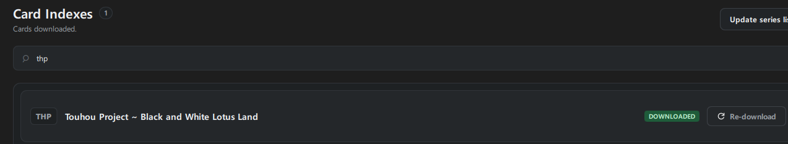

> [!TIP]
>  Both the Faiss Index and Card Index data need to be downloaded for a set before it can be detected properly — missing either one can cause incomplete results later.

---

## 3. Detecting a Decklist

1. Go to the **Detection** page.

   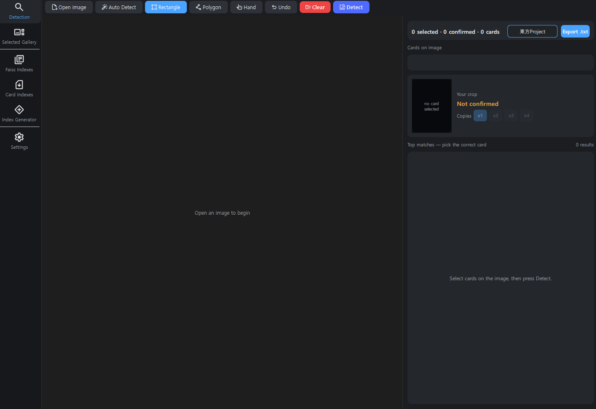

2. Click **Open Image** and select your saved decklist picture.
> [!TIP]
> You can also copy and paste the image (ctrl + c, ctrl + v)

   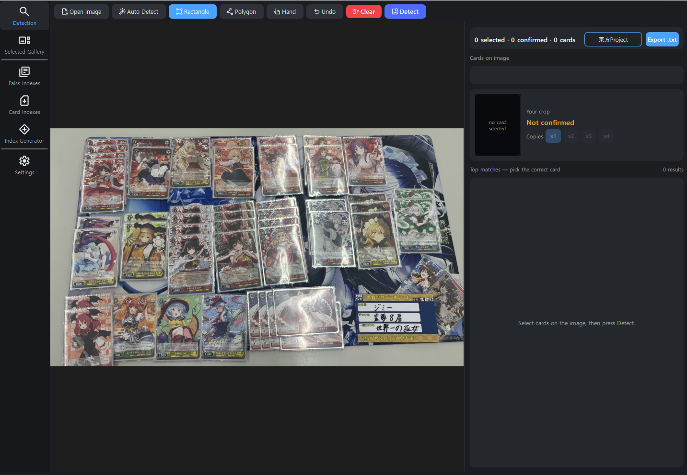

3. Select the cards using one of the following tools:
> [!TIP]
> Your selections don't need to look perfect — as long as it captures the majority of each card, detection should still work fine.
   - **Auto Detect Tool** — click each individual card.
   - **Manual tools** for cards the auto tool misses:
     - **Rectangle Tool** — click a corner and drag.
     - **Polygon Tool** — click each vertex of the card, then press **Enter**.
     - **Hand Tool** — going through each selection or moving vertex points.

> [!IMPORTANT]
>  You only need to select **one** copy of each unique card — no need to select duplicates of the same card.

   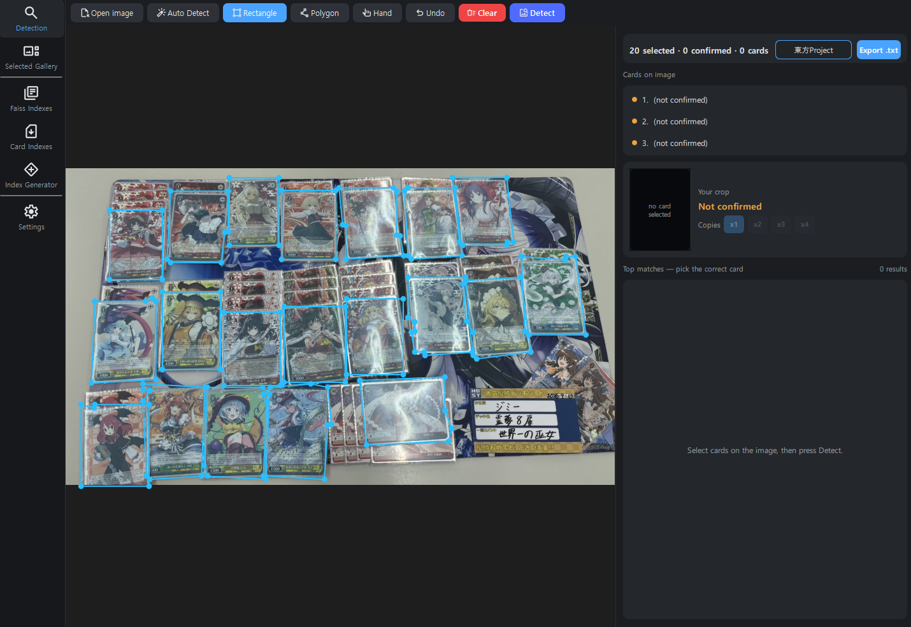

4. Once all cards are selected, click **Detect** to let the app identify them.

   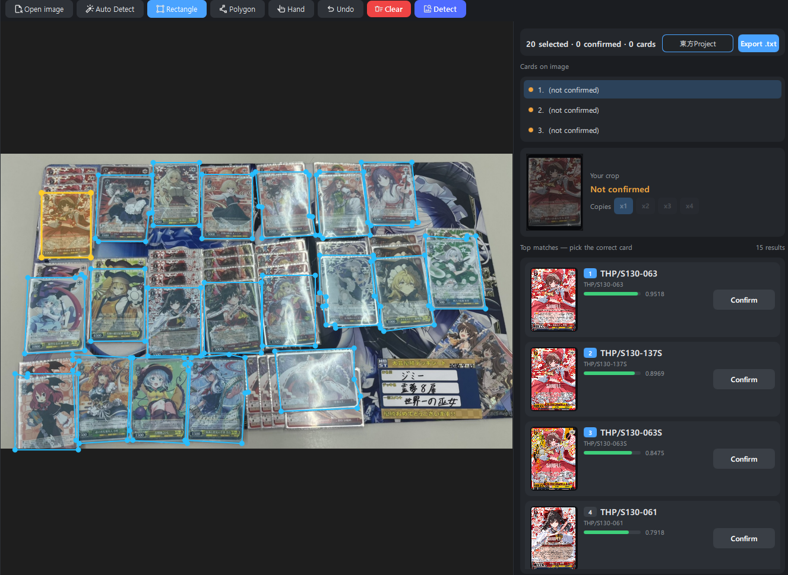

5. On the results page, click the card image or press **Space** to preview the identification result up close before confirming.
> [!NOTE]
> An exclamation point (`!`) means the card's data isn't yet available on the EncoreDecks API, so translations may be missing — or you may not have downloaded that card's data from the Card Index page yet.

6. Move through each cards with arrow keys or clicking the cards on the image view with the **Hand** tool

7. Adjust the quantity of each card in the list using the **×** control and confirm the cards.

   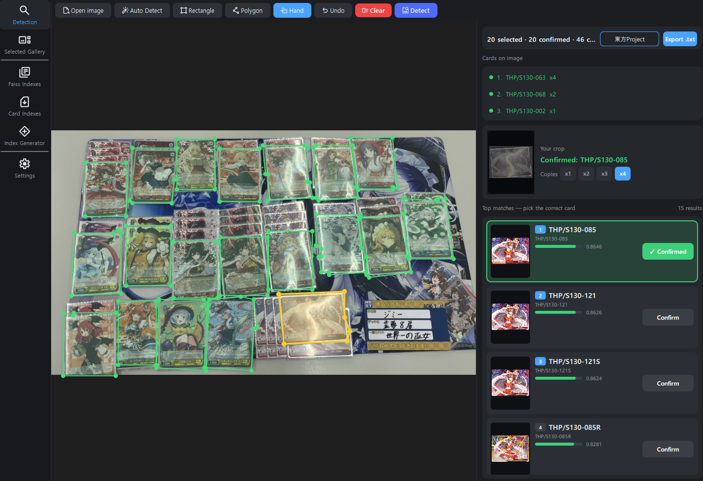

8. Once you've confirmed all identified cards, go to the **Gallery** tab to:
   - **See** the cards
   - **Export** the list as a `.txt` file to test it in **Blake Sim**.

   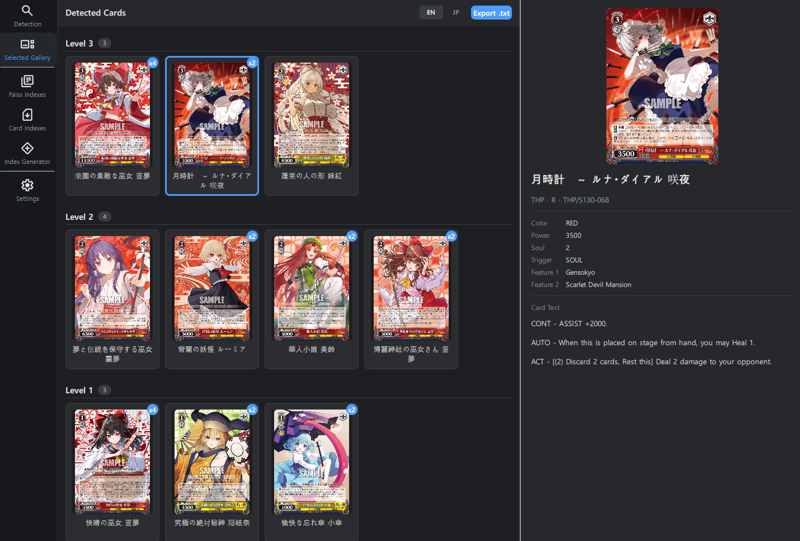

---

That's it — you're ready to start importing decklists!
