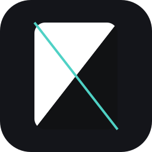
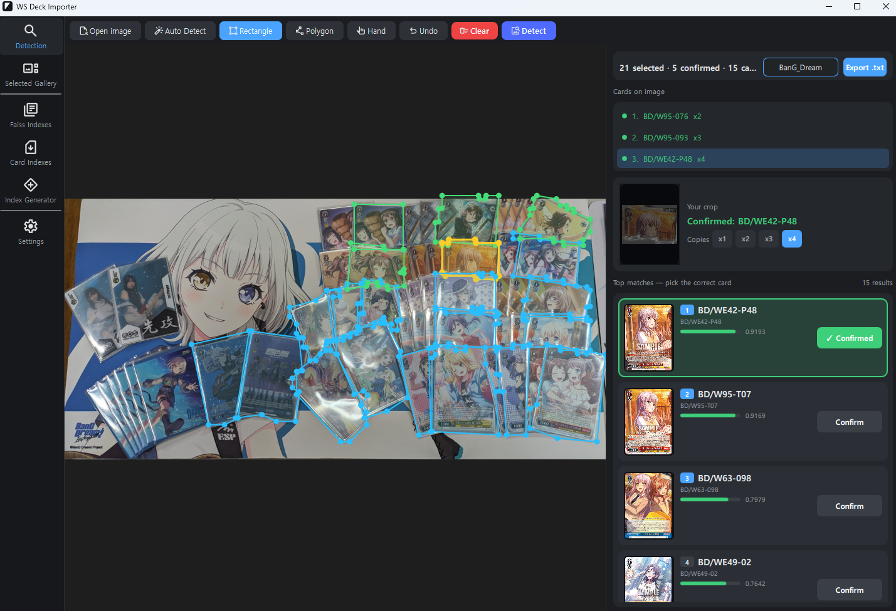
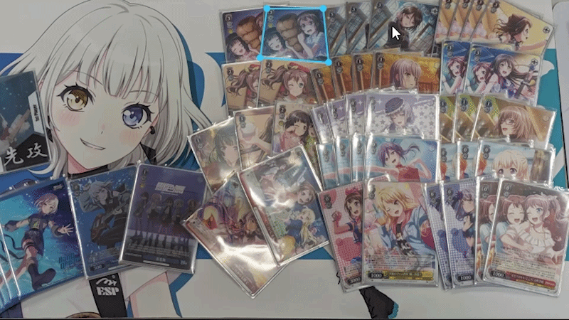
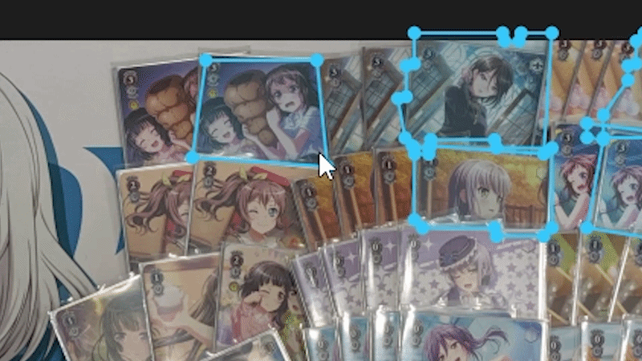
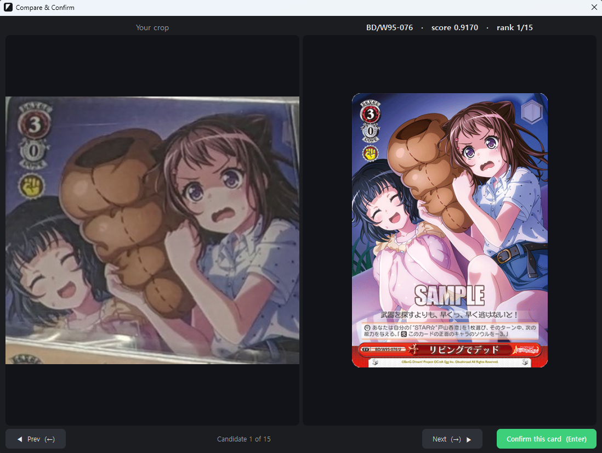
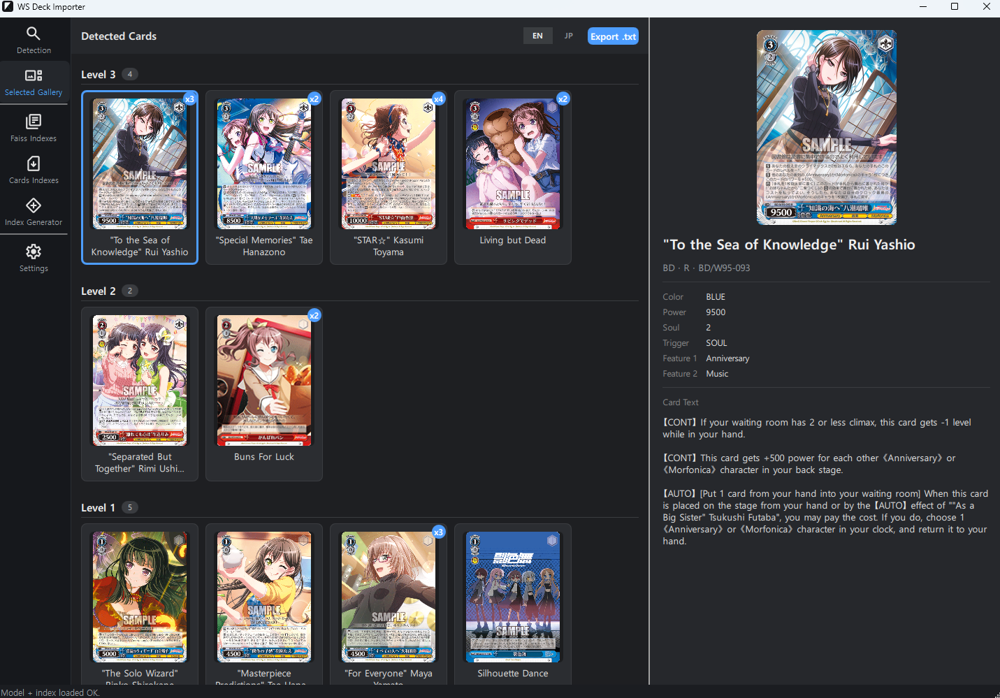
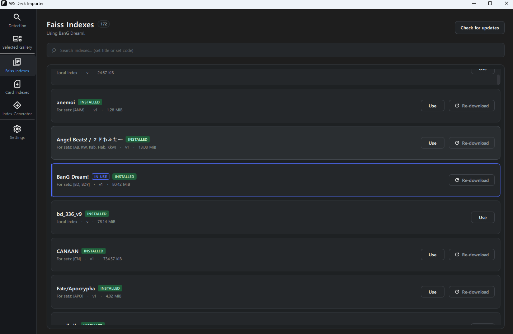
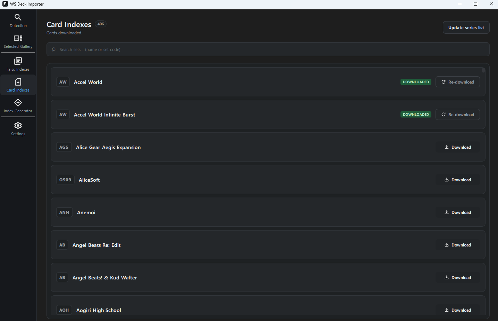
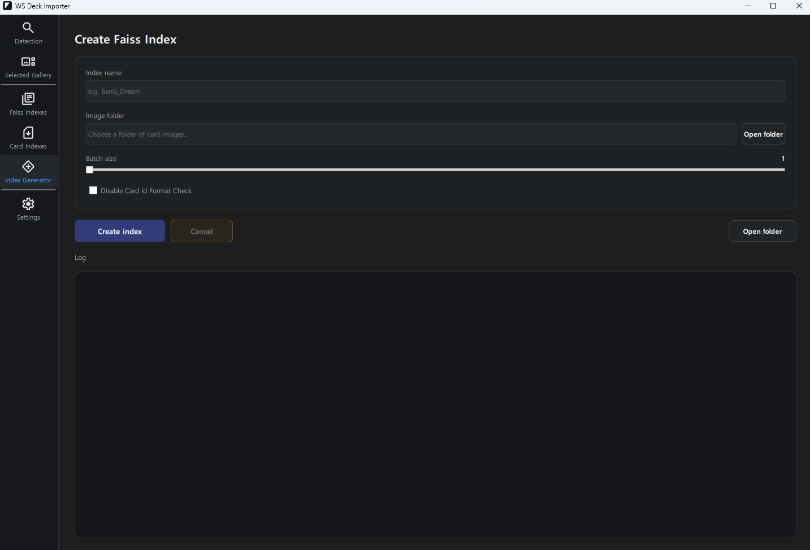

<div align="center">



# Weiss Schwarz Deck Importer

**Turn a deck image from anywhere into an importable deck list.**


<br>

[Quickstart](QUICKSTART.md) &nbsp;•&nbsp; [Download](#download) &nbsp;•&nbsp; [Features](#features) &nbsp;•&nbsp; [How it works](#how-it-works) &nbsp;•&nbsp; [FAQ](#faq)

<br>



</div>

> [!IMPORTANT]
> **First time?** Start with the **[Quickstart guide](QUICKSTART.md)**
---

## Overview

Found a deck someone posted on X, Discord, or a forum but it is a set that you are not familiar with?
Drop that image into the app and it identifies every card for you so you can read what every card does or import straight into a simulator.

It runs as a native desktop app on Windows, works offline once set up, and
pulls in card details and artwork automatically from [encoredecks](https://www.encoredecks.com/) api or [official cards list](https://ws-tcg.com/cardlist/).

---

## Features

<table>
<tr>
<td width="45%">

### Automatic card detection

No need to outline every card by hand. Just click on a card and the auto-detect tool
outlines it for you.

</td>
<td width="55%">
  
</td>
</tr>

<tr>
<td width="55%">
  
</td>
<td width="45%">

### Full control over your selections

Get every card framed exactly right. Adjust a selection by dragging its points, remove
points you don't need, and undo any change with full undo support.

</td>
</tr>

<tr>
<td width="45%">

### Verify before you confirm

For each card it identifies, you can check the source image against the matched card art
side by side. Catch any misreads and correct them, so the deck list you export is
actually the deck in the picture.

</td>
<td width="55%">
  
</td>
</tr>

<tr>
<td width="55%">
  
</td>
<td width="45%">

### Learn the cards and export

Once the deck is identified, you can see what each card does. Then export the deck list
as a `.txt` file, ready to import into Blake's simulator.

</td>
</tr>
</table>

<br>

### Card libraries and data

<table>
<tr>
<td width="55%">
  
</td>
<td width="45%">

### Download and manage recognition libraries

To identify cards, the app matches them against a **recognition library** (a FAISS
index). You don't have to build these yourself: browse the available libraries,
download the ones for the sets you care about, and switch between them at any time.
Custom libraries you've added or generated yourself sit right alongside the official
ones.

</td>
</tr>

<tr>
<td width="45%">

### Download card sets for names and translations

Download card data set by set from [encoredecks](https://www.encoredecks.com/) and once a set is installed, identified cards show full details, and Japanese cards are matched with their **English translations** automatically.

</td>
<td width="55%">
  
</td>
</tr>

<tr>
<td width="55%">
  
</td>
<td width="45%">

### Generate a library for any set

Is a set missing in the library? Build your own recognition library right inside the app.
Point the generator at a folder of card images, and it creates a ready-to-use library.

</td>
</tr>
</table>

> **Language support:** Japanese sets are supported today. English sets are coming soon.

---
## Required models

The app needs models to run. Both are hosted on Hugging Face. You will need to load them in settings on first launch.

<table>
<tr>
<td width="50%">

### [Card Identifier](https://huggingface.co/SamTheCoder777/Card_Identifier)

The vision model that recognizes which card is in an image. Fine-tuned from **[DINOv3](https://huggingface.co/facebook/dinov3-vitl16-pretrain-lvd1689m)**.

**[Download on Hugging Face »](https://huggingface.co/SamTheCoder777/Card_Identifier/resolve/main/card_identifier.onnx?download=true)**

</td>
<td width="50%">

### [Card Detector](https://huggingface.co/SamTheCoder777/Card_Detector)

The model that locates cards within an image, so they can be outlined automatically. Based on **[YOLOv8](https://huggingface.co/Ultralytics/YOLOv8)**.

**[Download on Hugging Face »](https://huggingface.co/SamTheCoder777/Card_Detector/resolve/main/card_detector.onnx?download=true)**

</td>
</tr>
</table>

> Model files are distributed separately from the application and are governed by their
> own licenses (see each model's Hugging Face page).
---

## Download


Grab the latest build for your platform from the [**Releases**](https://github.com/SamTheCoder777/WeissSchwarzDeckImporter/releases) page.

| Platform | |
|---|---|
| Windows | Download zip and unzip. Run WSDeckImporter.exe |
| macOS (Apple Silicon) | Not yet available (Soon) |

> [!NOTE]
> Start with the **[Quickstart guide](QUICKSTART.md)**

---

## FAQ

<details>
<summary><b>What kind of image can I use?</b></summary>
<br>
Most decklist photos and screenshots posted on X should work without any issue. The card identifier model is specifically trained to handle heavy occlusion, glare, and holo foil patterns.
</details>

<details>
<summary><b>I downloaded the card data but it still says the card data is missing from EncoreDecks!</b></summary>
<br>
If you tried to detect card without downloading the card data first, the program would have gotten the card data from the official weiss schwarz website and not encore decks<br><br>
  
You should go into settings > Advanced settings > Purge Fallbacks<br><br>
  
Then the next time you search that card, it should load from EncoreDecks properly.
</details>

<details>
<summary><b>Does it work without internet?</b></summary>
<br>
Yes and no. If you have downloaded the faiss index, cards index, the cards will be correctly identified but cards images and some cards that were missing from the encore decks api would be shown as "no data" on the gallery.
</details>

<details>
<summary><b>What if a card is missing from encore decks?</b></summary>
<br>
The app automatically checks a second, official weiss schwarz cards list. But the cards text will be in its original japanese language.
</details>

<details>
<summary><b>Which platforms are supported?</b></summary>
<br>
Windows for official support but it can also be manually built and ran on mac as well.
</details>

<details>
<summary><b>Is this an official Weiss Schwarz product?</b></summary>
<br>
No. This is an independent, non-commercial project made by fan. It is not affiliated with or endorsed by Bushiroad.
</details>

---

<div align="center">

## For developers and contributors

Want to look under the hood or help out? The details are below.

</div>

<details>
<summary><b>Tech overview</b></summary>
<br>

A native **C++ / Qt 6** desktop application. 

- A **fine-tuned DINOv3 ViT-L/16** vision backbone encodes a card image into an embedding vector, trained so a real-world image lands near that card's master image in embedding space.
- **FAISS** performs fast approximate nearest-neighbour search over the library of card embeddings.
- Inference runs through **ONNX Runtime** — GPU-accelerated via DirectML on Windows, CPU on macOS.

| Layer | Technology |
|---|---|
| Recognition model | DINOv3 ViT-L/16 (fine-tuned) → ONNX |
| Inference | ONNX Runtime (DirectML / CPU) |
| Search | FAISS |
| Application | C++20, Qt 6 (Widgets + QML) |
| Image processing | OpenCV |
| Local storage | SQLite |

</details>

<details>
<summary><b>Building from source</b></summary>
<br>

**Prerequisites:** Qt 6 (6.11+), CMake 3.24+, a C++20 compiler, ONNX Runtime, FAISS, and
OpenCV. [vcpkg](https://github.com/microsoft/vcpkg) is the easiest way to manage dependencies.

```bash
# Windows and macOS (Apple Silicon)
cmake -B build -DCMAKE_BUILD_TYPE=Release \
  -DCMAKE_TOOLCHAIN_FILE=<vcpkg>/scripts/buildsystems/vcpkg.cmake
cmake --build build --config Release
```

> Always build in **Release** — debug builds are dramatically slower. On macOS, build
> **native arm64** (not x86 under Rosetta) and link the arm64 ONNX Runtime. Ensure the
> release ONNX Runtime, OpenCV, and FAISS libraries are found at runtime.

</details>

<details>
<summary><b>Contributing</b></summary>
<br>

Contributions are welcome. Open an issue to discuss an idea, or submit a pull request.

</details>

---

## Acknowledgements

- **[Encoredecks](https://www.encoredecks.com/)** — For card translation and data
- **[Official Cardlist](https://ws-tcg.com/cardlist/)** — For cards that are missing on encoredecks
- **[DINOv3](https://github.com/facebookresearch/dinov3)** by Meta AI — the vision backbone (used under the DINOv3 license)
- **[YOLOv8](https://huggingface.co/Ultralytics/YOLOv8)** by Ultralytics — detects card outlines
- **[FAISS](https://github.com/facebookresearch/faiss)** — nearest-neighbour search
- **[ONNX Runtime](https://onnxruntime.ai/)** — cross-platform inference
- **[Qt](https://www.qt.io/)** — application framework

---

## Legal

This is a non-commercial, fan-made project. Weiss Schwarz, all associated card names,
artwork, and text are trademarks and copyrights of Bushiroad and its respective licensors.
This project is **not affiliated with, endorsed by, or sponsored by Bushiroad**.

No card images are bundled with this program. Card images are fetched at runtime from
publicly available third-party sources (e.g. Encoredecks, official Weiss Schwarz websites)
and remain the property of their original copyright holders.

The source code of this project is licensed under the GNU Affero General Public License
v3.0. This license applies only to the code itself. It does not grant any rights to
Weiss Schwarz card data, artwork, or trademarks.

</div>
